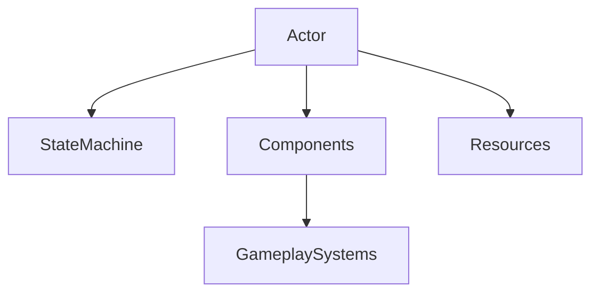
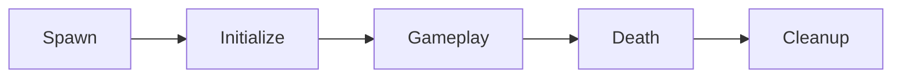

# Actor

> **Status:** Stable
>
> **Last Updated:** 2026-07-20
>
> **Related:**
> - overview.md
> - components.md
> - state-machine.md
> - resources.md
> - combat-architecture.md
> - ADR-002 — Composition over Inheritance
> - ADR-003 — Actor as the Base Gameplay Entity

---

# Purpose

This document defines the **Actor** concept used throughout Project Echo.

Actor is the central gameplay abstraction of the project.

Every gameplay system is designed around the assumption that active gameplay entities are represented by Actors.

Actor provides a common architectural foundation while delegating gameplay functionality to reusable components.

---

# Definition

An **Actor** is an active gameplay entity that:

- exists inside the game world;
- participates in gameplay;
- owns behavior;
- coordinates reusable gameplay components;
- owns a State Machine;
- has a gameplay lifecycle.

An Actor is **not** a gameplay system.

It is the object that brings gameplay systems together.

---

# Responsibilities

Actor is responsible for coordinating gameplay systems.

Its responsibilities include:

- owning Components;
- owning a State Machine;
- initializing owned systems;
- exposing common gameplay interfaces;
- managing its own lifecycle;
- providing access to configuration resources.

Actor intentionally avoids implementing gameplay mechanics.

---

# Out of Scope

Actor is **not** responsible for:

- calculating combat damage;
- implementing AI;
- implementing inventory;
- applying status effects;
- controlling procedural generation;
- managing user interface;
- handling save/load logic.

These responsibilities belong to dedicated gameplay systems.

---

# Architecture

The Actor acts as the composition root for gameplay entities.



Each Actor assembles a unique set of reusable systems.

Behavior emerges from composition rather than inheritance.

---

# Ownership

An Actor owns:

```text
Actor
│
├── Components
├── State Machine
├── Configuration Resources
└── Visual Representation
```

Owned objects exist only while the Actor exists.

The Actor is responsible for coordinating their lifecycle.

---

# Lifecycle

Every Actor follows the same high-level lifecycle.



## Spawn

The Actor enters the world.

---

## Initialize

The Actor initializes:

- Components;
- State Machine;
- references;
- configuration.

---

## Gameplay

The Actor participates in gameplay by coordinating its owned systems.

---

## Death

The Actor stops participating in gameplay.

Components are notified and perform their own cleanup if necessary.

---

## Cleanup

The Actor is removed from the world.

---

# Composition

Gameplay functionality is assembled from Components.

Example:

## Player

```text
Actor

├── HealthComponent
├── WeaponComponent
├── HurtboxComponent
├── HitboxComponent
├── MovementComponent
└── StateMachine
```

## Enemy

```text
Actor

├── HealthComponent
├── WeaponComponent
├── DetectionComponent
├── HurtboxComponent
├── HitboxComponent
└── StateMachine
```

## Training Dummy

```text
Actor

├── HealthComponent
├── HurtboxComponent
└── StateMachine
```

The Actor itself remains almost identical.

Capabilities are defined by composition.

---

# Communication

The Actor coordinates communication between its systems.

Preferred communication methods:

- explicit public APIs;
- Signals;
- shared gameplay events.

Components should avoid direct dependencies on each other whenever possible.

Instead, the Actor acts as the coordination point.

---

# Dependency Rules

Components may depend on:

- their owning Actor;
- configuration Resources;
- stable public APIs.

Components should **never** depend on:

- Player;
- Enemy;
- Boss;
- World;
- UI.

Components interact with the Actor abstraction rather than concrete implementations.

---

# What Is an Actor?

Typical Actors include:

- Player
- Enemy
- Boss
- NPC
- Companion
- Training Dummy
- Interactive Mechanism (if it actively participates in gameplay)

Every Actor owns behavior.

Every Actor has a gameplay lifecycle.

---

# What Is NOT an Actor?

The following objects are intentionally **not** Actors.

## World

Owns gameplay areas.

Does not participate in gameplay.

---

## Room

Contains gameplay.

Does not perform gameplay.

---

## TileMap

Represents geometry.

Contains no gameplay behavior.

---

## Resource

Stores configuration.

Contains no runtime behavior.

---

## UI

Displays gameplay.

Does not participate in gameplay.

---

## Visual Effects

Particles, shaders and animations support gameplay visually.

They are not gameplay entities.

---

# Design Principles

## Identity vs Capability

Actor defines identity.

Components define capabilities.

Example:

```text
Player
```

defines **what** the object is.

```text
HealthComponent
WeaponComponent
MovementComponent
```

define **what it can do**.

---

## Lightweight Coordinator

The Actor should coordinate systems rather than implement them.

Large gameplay systems belong inside Components.

---

## Stable Public Interface

The Actor exposes a small, stable API that Components may safely use.

This reduces coupling between systems.

---

# Best Practices

✔ Keep the Actor lightweight.

✔ Delegate gameplay logic to Components.

✔ Reuse Components across multiple Actors.

✔ Prefer composition over subclassing.

✔ Keep initialization centralized.

✔ Maintain explicit ownership.

---

# Anti-Patterns

Avoid:

❌ Large gameplay methods inside Actor.

❌ Actor-specific implementations of reusable systems.

❌ Components referencing concrete subclasses.

❌ Business logic inside lifecycle methods.

❌ Turning Actor into a "God Object".

---

# Examples

Good:

```text
Enemy
 ├── HealthComponent
 ├── DetectionComponent
 ├── WeaponComponent
 └── StateMachine
```

Good:

```text
Merchant
 ├── DialogueComponent
 ├── InteractionComponent
 └── StateMachine
```

Good:

```text
Boss
 ├── HealthComponent
 ├── WeaponComponent
 ├── PhaseComponent
 ├── DetectionComponent
 └── StateMachine
```

The architecture remains consistent regardless of gameplay role.

---

# Future Extensions

The Actor architecture is expected to support future systems without structural changes.

Examples include:

- InventoryComponent
- AbilityComponent
- BuffComponent
- DebuffComponent
- QuestComponent
- DialogueComponent
- InteractionComponent

New gameplay systems should be introduced as Components whenever possible.

---

# Decision Summary

Actor is the central gameplay abstraction of Project Echo.

It represents **identity**, coordinates gameplay systems and owns the lifecycle of reusable Components.

Gameplay functionality belongs to Components.

Behavior emerges from composition.

---

# Related Documents

- Architecture Overview
- Components
- State Machine
- Resources
- Combat Architecture
- ADR-002
- ADR-003
