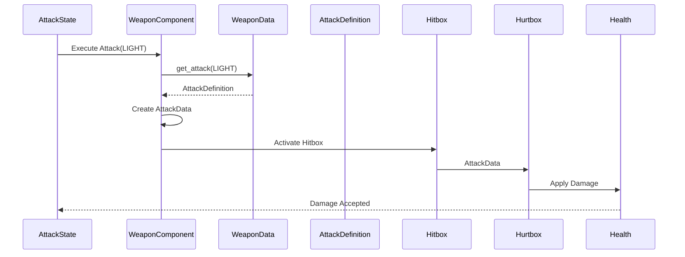

# Combat Architecture

> **Last Updated:** 2026-07-20
>
> **Related**
>
> - actor.md
> - components.md
> - state-machine.md
> - resources.md
> - resources-catalog.md

---

# Purpose

This document describes the combat architecture used throughout Project Echo.

Combat is implemented as a modular, data-driven pipeline composed of reusable Components coordinated by an Actor's State Machine.

The architecture separates:

- combat flow;
- combat configuration;
- runtime attack data;
- combat execution.

This separation keeps the combat system modular, extensible and easy to maintain.

---

# Combat Overview

Combat in Project Echo is built around three architectural layers.

```text
Configuration
        │
        ▼
Runtime Execution
        │
        ▼
Combat Resolution
```

Configuration Resources describe attacks.

Runtime Components execute attacks.

The combat pipeline resolves gameplay outcomes.

---

# Combat Pipeline

The combat architecture is organized as the following pipeline.


Each object owns exactly one responsibility.

---

# Combat Flow

The following sequence illustrates how a single attack is processed.



---

# Combat Pipeline

## 1. Attack Request

Combat begins when an Actor requests an attack.

Possible sources include:

- player input;
- enemy AI;
- scripted gameplay.

The State Machine transitions into `AttackState`.

---

## 2. Weapon Execution

`AttackState` delegates execution to `WeaponComponent`.

The WeaponComponent owns the currently equipped `WeaponData`.

---

## 3. Attack Selection

`WeaponComponent` requests the desired attack from the equipped weapon.

Example:

```text
AttackType.LIGHT
        │
        ▼
WeaponData.get_attack()
        │
        ▼
AttackDefinition
```

---

## 4. Attack Definition

`AttackDefinition` is a configuration Resource describing one attack.

It contains:

### Damage

- damage
- knockback_force
- attack_type

### Timing

- startup
- active
- recovery

### Animation

- animation_name

### Hitbox

- hitbox_offset
- hitbox_size

AttackDefinition is immutable during gameplay.

---

## 5. Runtime Attack

Immediately before the attack becomes active, `WeaponComponent` creates an `AttackData` instance.

`AttackData` is **not** a Resource.

It is implemented as a `RefCounted` runtime object.

Current structure:

```text
damage

knockback_force

source

direction
```

Its only responsibility is transporting attack information through the combat pipeline.

Once created, AttackData should be treated as immutable.

---

## 6. Hit Detection

`HitboxComponent` becomes active.

Responsibilities:

- detect collisions;
- identify valid targets;
- forward AttackData.

Hitboxes never modify gameplay state directly.

---

## 7. Damage Reception

The target's `HurtboxComponent` receives `AttackData`.

Typical validation includes:

- collision filtering;
- invulnerability frames;
- duplicate hit prevention.

If accepted:

```text
AttackData
		│
		▼
HealthComponent
```

---

## 8. Damage Processing

`HealthComponent` owns all health-related logic.

Responsibilities:

- apply damage;
- apply healing;
- clamp health values;
- detect death.

Health values are modified only inside HealthComponent.

---

## 9. Hit Reaction

If damage is successfully applied:

The Actor enters `HurtState`.

Typical responsibilities include:

- knockback;
- hit animation;
- temporary input lock;
- invulnerability timer.

Damage has already been processed before entering this State.

---

## 10. Recovery

When `HurtState` finishes:

```text
Hurt
 │
 ├──► Idle
 │
 ├──► Move
 │
 └──► Death
```

The next state depends on the Actor's current situation.

---

# Combat Participants

## State Machine

Responsible for:

- deciding when attacks occur;
- entering AttackState;
- entering HurtState.

The State Machine coordinates combat but never performs combat calculations.

---

## WeaponComponent

Responsible for:

- executing attacks;
- selecting AttackDefinitions;
- creating AttackData;
- activating Hitboxes.

---

## WeaponData

Configuration Resource describing a weapon.

Responsibilities:

- store weapon metadata;
- store available attacks;
- map AttackType to AttackDefinition.

Public API:

```text
get_attack(type)

get_attack_types()
```

WeaponData contains no runtime logic.

---

## AttackDefinition

Configuration Resource describing a single attack.

Contains:

- gameplay parameters;
- timings;
- animation reference;
- hitbox configuration.

AttackDefinition is shared by every instance of the same weapon.

---

## AttackData

Runtime payload object.

Implementation:

```text
RefCounted
```

Contains attack information that travels through the combat pipeline.

AttackData is immutable after creation.

---

## HitboxComponent

Responsible for:

- offensive collision detection.

Never:

- calculates damage;
- modifies health.

---

## HurtboxComponent

Responsible for:

- receiving attacks;
- validating attacks;
- forwarding AttackData.

---

## HealthComponent

Responsible for:

- health;
- damage;
- healing;
- death.

The HealthComponent is the only system allowed to modify health.

---

## HurtState

Responsible for:

- hit reaction;
- knockback timing;
- recovery timing;
- invulnerability timing.

---

# Attack Types

Combat actions are identified using `AttackType`.

Current attack types:

```text
LIGHT

HEAVY

JUMP

DASH

SPECIAL
```

AttackType represents gameplay intent.

It is independent from:

- player input;
- animation names;
- weapon implementation.

---

# Configuration vs Runtime

Project Echo explicitly separates configuration from runtime execution.

```text
WeaponData
        │
        ▼
AttackDefinition
        │
        ▼
AttackData
```

| Object | Purpose | Lifetime |
|----------|---------|----------|
| WeaponData | Weapon configuration | Project asset |
| AttackDefinition | Attack configuration | Project asset |
| AttackData | Runtime attack payload | Single attack |

---

# Ownership

```text
Actor
│
├── State Machine
├── WeaponComponent
├── HitboxComponent
├── HurtboxComponent
├── HealthComponent
└── DetectionComponent
```

Configuration Resources:

```text
WeaponComponent
        │
        ▼
WeaponData
        │
        ▼
AttackDefinition
```

Runtime Payload:

```text
AttackData
```

---

# Design Principles

## Data-Driven Combat

Gameplay behavior is defined by configuration Resources.

Runtime systems interpret those Resources.

---

## Separation of Responsibilities

```text
AttackState
        │
        ▼
Decides when to attack

WeaponComponent
        │
        ▼
Selects which attack to execute

AttackDefinition
        │
        ▼
Describes the attack

AttackData
        │
        ▼
Represents one runtime attack

HealthComponent
        │
        ▼
Applies gameplay consequences
```

---

## Single Responsibility

Every participant owns exactly one gameplay responsibility.

---

## Explicit Ownership

Each Component owns only its own behavior.

No Component directly modifies another Component's internal state.

---

# Best Practices

- Keep attack configuration inside `AttackDefinition`.
- Keep weapon configuration inside `WeaponData`.
- Treat `AttackData` as immutable.
- Apply damage only inside `HealthComponent`.
- Keep States responsible for timing.
- Keep Components responsible for gameplay behavior.

---

# Anti-Patterns

Avoid:

- Applying damage inside `WeaponComponent`.
- Modifying health outside `HealthComponent`.
- Storing runtime state inside Resources.
- Coupling combat logic to specific Actor subclasses.
- Mixing gameplay calculations with animation timing.

---

# Decision Summary

Combat in Project Echo is implemented as a modular, data-driven pipeline.

- `WeaponData` defines the weapon.
- `AttackDefinition` describes a specific attack.
- `AttackData` represents a runtime attack instance.
- Components execute combat behavior.
- The State Machine coordinates combat flow.

This separation provides a flexible, reusable and maintainable combat architecture.

---

# Related Documents

- Actor
- Components
- State Machine
- Resources
- Resources Catalog
```
