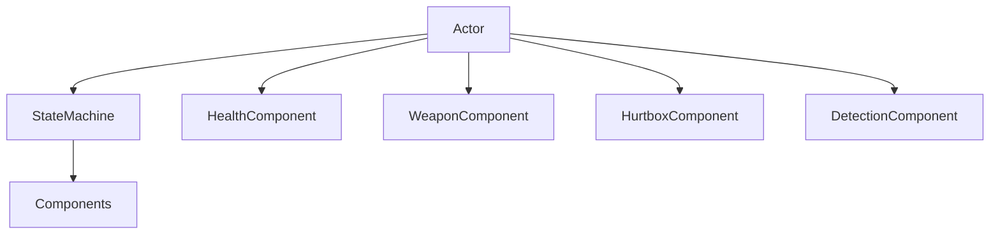

# Components

> **Status:** Stable
>
> **Last Updated:** 2026-07-20
>
> **Related:**
> - overview.md
> - actor.md
> - state-machine.md
> - resources.md
> - combat-architecture.md
> - ADR-002 — Composition over Inheritance
> - ADR-003 — Actor as the Base Gameplay Entity

---

# Purpose

This document defines the Component architecture used throughout Project Echo.

Components are the primary building blocks of gameplay functionality.

Rather than implementing gameplay logic inside Actors, Project Echo assembles gameplay behavior by composing Actors from independent Components.

This approach promotes reuse, maintainability and clear separation of responsibilities.

---

# Definition

A **Component** is a reusable gameplay module that provides a single capability to its owning Actor.

A Component:

- owns one gameplay responsibility;
- manages its own internal state;
- exposes a clear public API;
- collaborates with other systems through stable interfaces.

A Component does **not** define the identity of an Actor.

It defines what the Actor is capable of doing.

---

# Responsibilities

A Component is responsible for:

- implementing one gameplay feature;
- managing its own internal state;
- exposing functionality to other systems;
- reacting to gameplay events;
- remaining reusable across multiple Actor types.

Examples include:

- Health
- Weapon
- Hitbox
- Hurtbox
- Detection
- Movement
- Interaction
- Dialogue (future)

---

# Out of Scope

A Component is **not** responsible for:

- controlling the Actor lifecycle;
- world generation;
- scene management;
- user interface;
- save/load management;
- coordinating unrelated systems.

Those responsibilities belong elsewhere.

---

# Architecture

Every Component belongs to exactly one Actor.



The Actor owns Components.

The State Machine coordinates their usage.

Components provide gameplay capabilities.

---

# Component Lifecycle

A Component follows the lifecycle of its owning Actor.


## Created

The Component is instantiated.

---

## Initialized

References and configuration are assigned.

---

## Active

The Component participates in gameplay.

---

## Disabled

The Component temporarily stops affecting gameplay.

---

## Destroyed

The owning Actor is removed.

The Component is destroyed together with its owner.

---

# Ownership

Each Component has exactly one owner.

```text
Actor
 ├── HealthComponent
 ├── WeaponComponent
 ├── HurtboxComponent
 └── DetectionComponent
```

Components should never exist independently of an Actor.

Ownership is explicit and stable.

---

# Communication

Components communicate through well-defined interfaces.

Preferred methods include:

- public APIs;
- Godot Signals;
- shared data objects (such as AttackData).

Whenever possible, Components should avoid direct knowledge of each other.

Instead, communication should be coordinated by the Actor or the State Machine.

---

# Dependencies

Components may depend on:

- their owning Actor;
- configuration Resources;
- shared data objects;
- engine services.

Components should **never** depend on:

- Player;
- Enemy;
- Boss;
- specific Rooms;
- World;
- UI.

Components must remain reusable.

---

# Component Categories

The project distinguishes several categories of Components.

## Gameplay Components

Examples:

- HealthComponent
- WeaponComponent
- InventoryComponent (future)

These implement gameplay rules.

---

## Combat Components

Examples:

- HitboxComponent
- HurtboxComponent

These participate in the combat pipeline.

---

## AI Components

Examples:

- DetectionComponent
- VisionComponent (future)

These provide information used by AI.

---

## Utility Components

Examples:

- InteractionComponent
- DialogueComponent
- BuffComponent

These support additional gameplay systems.

---

# Design Principles

## Single Responsibility

Each Component owns one gameplay concern.

Example:

HealthComponent manages health.

It does not calculate movement or AI.

---

## Reusability

A Component should work with any compatible Actor.

The same implementation should be usable by:

- Player
- Enemy
- Boss
- NPC
- Training Dummy

---

## Encapsulation

A Component owns its internal state.

Other systems interact through its public API.

Implementation details remain private.

---

## Loose Coupling

Components should communicate through interfaces rather than implementation details.

Knowledge of unrelated systems should be minimized.

---

## Data-Driven Configuration

Whenever practical, configuration belongs inside Resources rather than code.

Example:

WeaponComponent receives WeaponData instead of hardcoded values.

---

# Examples

## HealthComponent

Responsible for:

- current health;
- maximum health;
- damage processing;
- healing.

Not responsible for:

- animations;
- death effects;
- AI reactions.

---

## WeaponComponent

Responsible for:

- attack execution;
- attack timing;
- hitbox activation.

Not responsible for:

- enemy AI;
- movement;
- health management.

---

## DetectionComponent

Responsible for:

- sensing nearby targets;
- reporting visible Actors.

Not responsible for:

- movement;
- pathfinding;
- attack decisions.

---

## HurtboxComponent

Responsible for:

- receiving attacks;
- forwarding AttackData.

Not responsible for:

- calculating damage;
- applying knockback logic;
- deciding whether the Actor dies.

---

# Best Practices

✔ One responsibility per Component.

✔ Expose a clean public API.

✔ Keep Components reusable.

✔ Use Resources for configuration.

✔ Keep communication explicit.

✔ Document public behavior.

---

# Anti-Patterns

Avoid:

❌ Components depending on concrete Actor subclasses.

❌ Components creating other Components.

❌ Components directly controlling the World.

❌ Components implementing multiple gameplay systems.

❌ Circular dependencies between Components.

❌ "Manager Components" that know too much.

---

# Future Extensions

Future gameplay systems should continue following the same architecture.

Examples include:

- AbilityComponent
- EquipmentComponent
- StatusEffectComponent
- QuestComponent
- CraftingComponent
- DialogueComponent

New functionality should be introduced by creating new Components rather than extending existing ones beyond their responsibility.

---

# Decision Summary

Components are reusable gameplay modules.

Actors define identity.

State Machines coordinate behavior.

Components provide capabilities.

Maintaining this separation is one of the core architectural principles of Project Echo.

---

# Related Documents

- Architecture Overview
- Actor
- State Machine
- Resources
- Combat Architecture
- ADR-002
- ADR-003
