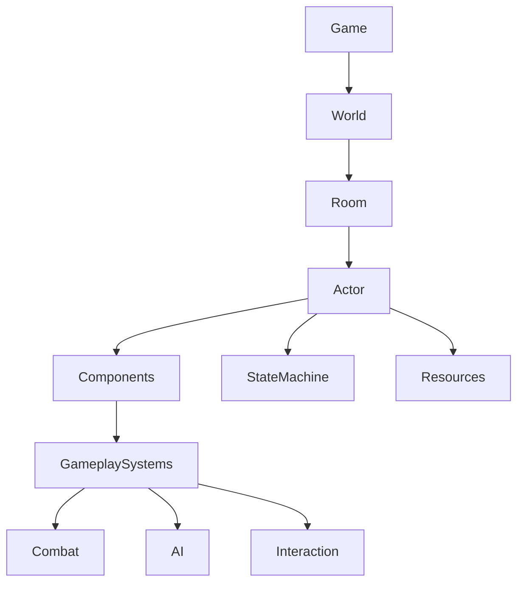
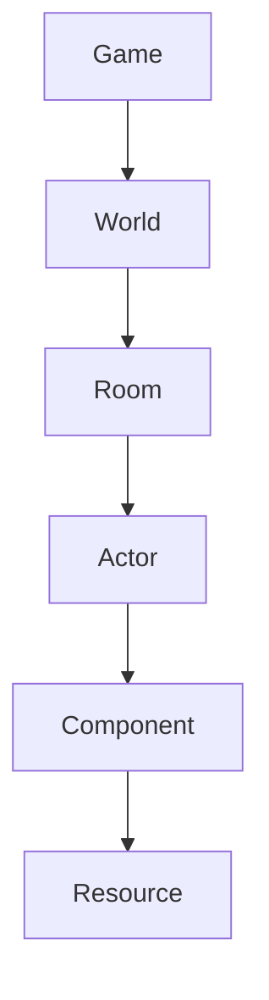

# Architecture Overview

> **Status:** Stable
>
> **Last Updated:** 2026-07-19
>
> **Related:**
> - project-structure.md
> - actor.md
> - components.md
> - state-machine.md
> - resources.md
> - combat-architecture.md
> - world-architecture.md

---

# Purpose

This document provides a high-level overview of the Project Echo architecture.

It describes the major building blocks of the project, their responsibilities, and the relationships between them. Detailed implementation is intentionally omitted and documented in dedicated architecture documents.

The primary goal of the architecture is to create a modular, maintainable, and scalable codebase that allows new gameplay systems to be introduced with minimal impact on existing code.

---

# Architectural Goals

Project Echo is designed around the following goals:

- Build reusable gameplay systems.
- Minimize coupling between systems.
- Separate gameplay logic from configuration.
- Prefer composition over inheritance.
- Keep systems data-driven whenever possible.
- Design for long-term maintainability rather than short-term convenience.

---

# High-Level Architecture

The project is built from several independent layers. Each layer has a clearly defined responsibility and communicates only with the layers directly below it.

---

# Core Building Blocks

## Game

The root of the application.

Responsible for:

- application lifecycle;
- global services;
- loading and unloading worlds;
- save/load management (future);
- global managers.

---

## World

The World is responsible for assembling and managing the playable environment.

Responsibilities include:

- biome generation;
- room placement;
- room streaming;
- world progression;
- player traversal between rooms.

The World never controls gameplay logic inside individual Actors.

---

## Room

A Room is the smallest self-contained gameplay area.

A Room contains:

- level geometry;
- actors;
- decorations;
- spawn points;
- gameplay triggers;
- navigation information.

Rooms are treated as reusable building blocks for procedural generation.

---

## Actor

Actors represent gameplay entities.

Examples include:

- Player
- Enemy
- NPC
- Interactive objects (future)

Actors coordinate gameplay components but avoid implementing gameplay systems directly.

Detailed information is available in `actor.md`.

---

## Components

Gameplay functionality is implemented through reusable components.

Examples:

- Health
- Weapon
- Hitbox
- Hurtbox
- Detection
- Movement
- Animation

Components should be independent and reusable.

Detailed information is available in `components.md`.

---

## State Machine

Behavior is controlled through a universal finite state machine.

Each Actor owns its own State Machine.

Different Actors use different states while sharing the same underlying implementation.

Examples:

Player

- Idle
- Move
- Jump
- Fall
- Attack
- Hurt
- Dead

Enemy

- Idle
- Patrol
- Chase
- Attack
- Hurt
- Dead

Detailed information is available in `state-machine.md`.

---

## Resources

Configuration data is stored inside Godot Resources.

Typical examples include:

- character statistics;
- movement settings;
- weapon definitions;
- enemy configuration;
- room metadata.

Gameplay code should read configuration from Resources rather than hardcoding values.

Detailed information is available in `resources.md`.

---

# Gameplay Systems

Gameplay systems are implemented independently from Actors.

Examples include:

- Combat
- AI
- Status Effects
- Inventory (future)
- Progression (future)

Each system is responsible only for its own domain.

---

# Communication

Project Echo uses explicit communication between systems.

Preferred communication methods are:

- Signals
- Explicit references
- Well-defined public APIs

Direct dependencies should be minimized.

Whenever possible, components should not depend on implementation details of other components.

---

# Dependency Rules

Dependencies always point downward.

Lower-level systems must never depend on higher-level systems.

Examples:

✔ Components know nothing about the World.

✔ HealthComponent does not know about Player.

✔ WeaponComponent does not know about Enemy AI.

This keeps gameplay systems reusable.

---

# Design Principles

## Composition over Inheritance

Gameplay behavior should be assembled through components rather than deep inheritance hierarchies.

---

## Data-Driven Design

Configuration belongs in Resources.

Logic belongs in code.

---

## Single Responsibility

Each system should solve one problem.

---

## Loose Coupling

Systems communicate through stable interfaces.

Implementation details remain private.

---

## Explicit Ownership

Every object has a clearly defined owner.

Example:

- World owns Rooms.
- Room owns Actors.
- Actor owns Components.
- Components own their internal state.

Ownership should never be ambiguous.

---

## Reusability

Gameplay systems should work for any Actor whenever possible.

Player-specific and Enemy-specific logic should remain outside reusable components.

---

# Architecture Boundaries

This document intentionally does **not** describe:

- individual gameplay mechanics;
- combat implementation;
- world generation algorithms;
- AI behavior;
- save system;
- rendering;
- UI.

Each of these topics has (or will have) its own dedicated document.

---

# Documentation Philosophy

Architecture documentation is considered part of the project.

Before implementing major systems:

1. Design the architecture.
2. Document the architecture.
3. Implement the system.
4. Update documentation if implementation changes.

Documentation is treated as the primary architectural reference for Project Echo.

---

# Future Documents

The following documents expand on this overview:

- Project Structure
- Actor
- Components
- Resources
- State Machine
- Combat Architecture
- World Architecture
- AI Architecture
- Event System
- Save System
