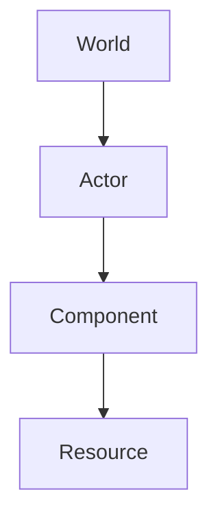

# Project Structure

> **Status:** Stable
>
> **Last Updated:** 2026-07-19
>
> **Related:**
> - overview.md
> - actor.md
> - components.md
> - resources.md

---

# Purpose

This document defines the directory structure of Project Echo.

A well-defined project structure improves discoverability, reduces ambiguity, and ensures that new systems are added consistently as the project grows.

The goal is to organize the project by **responsibility**, not by implementation details.

---

# Design Principles

The project structure follows several principles:

- Group files by responsibility.
- Keep related assets together.
- Separate gameplay logic from configuration.
- Separate code from content.
- Avoid generic folders such as `misc` or `utils`.
- Prefer explicit organization over deep nesting.

---

# Root Directory

```text
project-echo/
│
├── addons/
├── assets/
├── docs/
├── project/
├── tests/
├── .gitignore
├── LICENSE
└── README.md
```

---

# Root Folder Responsibilities

## addons/

Third-party Godot plugins.

Examples:

- editor plugins
- import tools
- debugging tools

Project-specific code should never be placed here.

---

## assets/

Contains all game assets.

Examples:

- sprites
- animations
- audio
- fonts
- shaders
- particles

Assets should remain independent from gameplay code.

---

## docs/

Technical documentation.

Contains:

- architecture
- gameplay
- world generation
- ADR
- roadmap

Documentation is maintained together with the project.

---

## project/

Contains the actual Godot project.

Everything required to build the game lives here.

---

## tests/

Automated tests.

Future integration tests.

Gameplay validation.

---

# Godot Project Structure

```text
project/
│
├── actors/
├── autoload/
├── components/
├── resources/
├── scenes/
├── systems/
├── ui/
├── world/
└── main.tscn
```

---

# actors/

Contains gameplay entities.

```text
actors/

Player/

Enemy/

NPC/

Interactive/
```

Each Actor owns its own scene and scripts.

Examples:

- Player
- Enemy
- NPC
- Boss
- Interactive Objects

Detailed architecture is described in `actor.md`.

---

# components/

Contains reusable gameplay components.

Example:

```text
components/

Health/

Weapon/

Hitbox/

Hurtbox/

Movement/

Detection/

Animation/
```

Each component implements one isolated gameplay responsibility.

Components should never depend on specific Actors.

Detailed information is available in `components.md`.

---

# resources/

Contains Godot Resources.

Examples:

```text
resources/

characters/

weapons/

enemies/

rooms/

items/
```

Resources define gameplay data.

They should not contain gameplay logic.

Detailed information is available in `resources.md`.

---

# systems/

Contains global gameplay systems.

Examples:

```text
systems/

Combat/

Inventory/

Save/

Audio/

Localization/

Achievements/
```

Systems coordinate gameplay but are not attached to individual Actors.

---

# scenes/

Contains standalone scenes.

Examples:

```text
scenes/

MainMenu/

Loading/

HUD/

Debug/

Transitions/
```

These scenes represent game flow rather than gameplay entities.

---

# world/

Contains world-related content.

Examples:

```text
world/

Biomes/

Rooms/

Generation/

Decoration/
```

World generation and room authoring are documented separately.

---

# ui/

Contains user interface.

Examples:

```text
ui/

HUD/

Inventory/

Menus/

Widgets/
```

UI should remain independent from gameplay logic whenever possible.

---

# autoload/

Contains Godot singleton services.

Examples:

- GameManager
- SaveManager
- AudioManager
- SceneManager

Autoloads provide global services.

Gameplay mechanics should not be implemented here.

---

# Asset Structure

The `assets/` directory mirrors gameplay domains.

Example:

```text
assets/

art/

audio/

fonts/

shaders/

vfx/
```

Whenever practical, asset organization should match gameplay organization.

Example:

```text
actors/

Player/
```

has corresponding assets inside

```text
assets/art/player/
```

This improves discoverability.

---

# Naming Conventions

Folders use:

```text
snake_case
```

Examples:

```text
state_machine/

world_generation/

health_component/
```

Scene names use:

```text
PascalCase
```

Examples:

```text
Player.tscn

Enemy.tscn

HealthComponent.tscn
```

Scripts use the same name as their primary class.

Example:

```text
Player.gd

Player.tscn
```

---

# Dependency Rules

The directory structure reflects dependency direction.



Higher-level systems may depend on lower-level systems.

Lower-level systems must never depend on higher-level systems.

---

# Best Practices

- Keep folders focused on a single responsibility.
- Place reusable code in reusable locations.
- Keep gameplay configuration inside Resources.
- Avoid circular dependencies.
- Prefer creating a new folder over introducing ambiguous names.

---

# Anti-Patterns

Avoid:

```text
misc/

helpers/

scripts/

temp/

new/
```

These folders usually become catch-all locations with unclear ownership.

Avoid mixing:

- gameplay code
- UI
- resources
- assets

inside the same directory.

---

# Future Extensions

As the project grows, additional top-level folders may be introduced.

Examples:

```text
editor/

network/

modding/

analytics/
```

These folders should only be added when they represent independent project domains.

---

# Related Documentation

- Architecture Overview
- Actor
- Components
- Resources
- World Architecture
