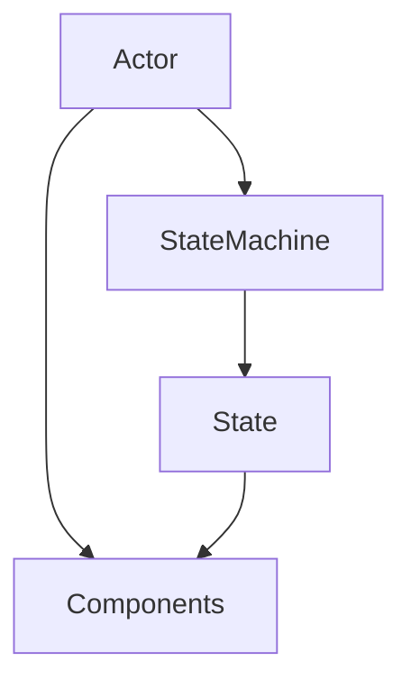
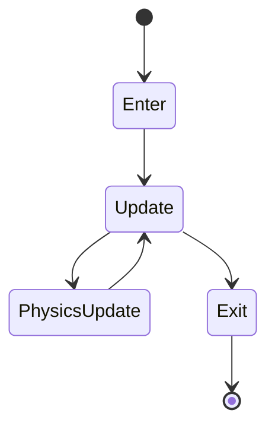

# State Machine

> **Status:** Stable
>
> **Last Updated:** 2026-07-20
>
> **Related:**
> - overview.md
> - actor.md
> - components.md
> - combat-architecture.md

---

# Purpose

This document describes the State Machine architecture used by gameplay Actors in Project Echo.

The State Machine coordinates Actor behavior by determining **what the Actor is currently doing**.

It does not implement gameplay mechanics itself.

Instead, it orchestrates reusable Components to produce gameplay behavior.

---

# Definition

A **State Machine** is responsible for controlling the execution flow of an Actor.

It determines:

- which state is currently active;
- when transitions occur;
- which Components should be used by the active state.

Gameplay behavior emerges from the collaboration between States and Components.

---

# Responsibilities

The State Machine is responsible for:

- managing the active State;
- performing state transitions;
- enforcing transition rules;
- updating the active State;
- coordinating high-level Actor behavior.

---

# Out of Scope

The State Machine is **not** responsible for:

- calculating combat damage;
- detecting enemies;
- moving physics bodies;
- storing health;
- applying status effects;
- generating the world.

Those responsibilities belong to dedicated Components or Systems.

---

# Architecture



The Actor owns both the State Machine and its Components.

The active State coordinates Components to perform gameplay actions.

---

# Ownership

Each Actor owns exactly one State Machine.

```text
Actor
│
├── State Machine
│     ├── Idle
│     ├── Move
│     ├── Jump
│     ├── Fall
│     ├── Attack
│     └── Hurt
│
├── HealthComponent
├── WeaponComponent
├── DetectionComponent
└── HurtboxComponent
```

States belong to the State Machine.

Components belong to the Actor.

---

# State Lifecycle

Each State follows the same lifecycle.



## Enter

Executed once when the State becomes active.

Typical responsibilities:

- initialize timers;
- reset temporary values;
- start animations.

---

## Update

Executed every frame.

Handles frame-dependent gameplay logic.

---

## Physics Update

Executed during the physics step.

Handles:

- movement;
- collision-related logic;
- physics interactions.

---

## Exit

Executed once before leaving the State.

Typical responsibilities:

- stop temporary effects;
- release resources;
- restore Actor configuration.

---

# Transition Rules

State transitions should be:

- explicit;
- deterministic;
- easy to understand.

A State should never silently transition to multiple destinations.

Instead, transition conditions should be clearly defined.

Example:

```text
Idle

↓

Move

↓

Jump

↓

Fall

↓

Idle
```

---

# Components Interaction

States do not implement gameplay systems directly.

Instead, they coordinate Components.

Example:

AttackState

```text
Enter

↓

WeaponComponent.start_attack()

↓

HitboxComponent.enable()

↓

AnimationPlayer.play()

↓

Exit

↓

HitboxComponent.disable()
```

The attack logic remains inside the Weapon and Hitbox Components.

---

Another example:

HurtState

```text
Enter

↓

HealthComponent

↓

Knockback

↓

Animation

↓

Return
```

The State controls timing.

Components perform the work.

---

# Communication

States may communicate with:

- the owning Actor;
- Components;
- AnimationPlayer;
- Timers.

States should avoid direct communication with:

- unrelated Actors;
- UI;
- World systems.

---

# State Categories

Typical gameplay states include:

## Locomotion

- Idle
- Move
- Jump
- Fall
- Dash (future)

---

## Combat

- Attack
- Hurt
- Death

---

## AI

Enemy-specific examples:

- Patrol
- Chase
- Search

---

## Interaction

Future examples:

- Dialogue
- Interact
- Climb
- Use Lever

---

# Design Principles

## One State — One Intent

Each State represents one clear gameplay intention.

Examples:

- Running
- Jumping
- Attacking

A State should not attempt to represent multiple behaviors simultaneously.

---

## Components Perform Work

States coordinate.

Components execute.

This keeps gameplay systems reusable.

---

## Stateless Transitions

Whenever practical, transition conditions should depend on observable Actor state rather than hidden flags.

---

## Predictable Flow

State transitions should be easy to visualize and debug.

---

# Best Practices

✔ Keep States lightweight.

✔ Delegate gameplay logic to Components.

✔ Use Enter/Exit for temporary changes.

✔ Make transitions explicit.

✔ Keep responsibilities focused.

---

# Anti-Patterns

Avoid:

❌ Large gameplay systems inside States.

❌ Direct damage calculations.

❌ Hardcoded references to specific Actors.

❌ State-specific implementations of reusable mechanics.

❌ Circular transition logic.

---

# Examples

Player

```text
Idle

Move

Jump

Fall

Attack

Hurt

Death
```

Enemy

```text
Idle

Patrol

Chase

Attack

Hurt

Death
```

Although the States differ, both Actors follow the same architecture.

---

# Future Extensions

The State Machine architecture is expected to support future gameplay systems such as:

- climbing;
- swimming;
- wall sliding;
- ledge grabbing;
- abilities;
- transformations;
- scripted sequences.

New States should coordinate existing Components whenever possible instead of introducing duplicate gameplay logic.

---

# Decision Summary

The State Machine controls **what an Actor is doing**.

Components determine **how gameplay actions are performed**.

The Actor owns both and coordinates their lifecycle.

This separation creates a flexible, reusable and maintainable gameplay architecture.

---

# Related Documents

- Architecture Overview
- Actor
- Components
- Combat Architecture
