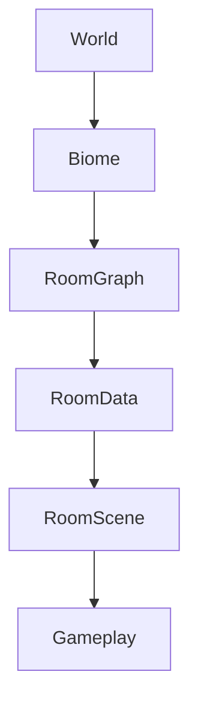

# World Architecture Overview

> **Status:** In Progress
>
> **Last Updated:** 2026-07-19
>
> **Related:**
> - room-architecture.md
> - room-data.md
> - world-generation.md

---

# Purpose

This document describes the high-level architecture of the world system in Project Echo.

The world is built from handcrafted gameplay rooms that are assembled into a procedurally generated world. The system is designed to balance designer control with procedural replayability.

---

# Design Goals

The world system should provide:

- Handcrafted gameplay quality
- Procedural replayability
- Reusable room assets
- Data-driven generation
- Future biome support
- Future streaming support

---

# High-Level Architecture

---

# Core Concepts

## World

Represents the complete playable game world.

The World manages:

- biome selection
- room graph generation
- room loading
- world progression

---

## Biome

Defines a collection of compatible rooms and generation rules.

Future responsibilities include:

- visual theme
- enemy pools
- music
- generation constraints
- progression rules

---

## Room

The smallest generation unit.

A room is a handcrafted gameplay space rather than a collection of generated tiles.

---

# Current Scope

Implemented conceptually:

- Room architecture
- RoomData
- Semantic Tiles
- Connection Points

Not yet implemented:

- Biome generation
- Room validation
- World streaming
