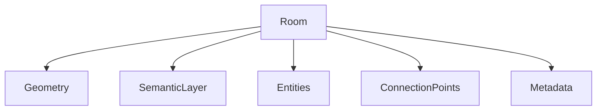

# Room Architecture

> **Status:** In Progress
>
> **Last Updated:** 2026-07-19
>
> **Related:**
> - overview.md
> - room-data.md
> - semantic-tiles.md
> - connection-points.md

---

# Purpose

A Room is the fundamental gameplay building block of Project Echo.

Instead of generating gameplay from individual tiles, the game generates worlds from reusable room assets.

---

# Responsibilities

A Room is responsible for containing:

- Geometry
- Gameplay layout
- Entities
- Decorations
- Connection Points
- Metadata

A Room is **not** responsible for world generation.

---

# Room Composition



---

# Runtime Lifecycle

```mermaid
graph TD

RoomData

↓

Instantiate Scene

↓

Spawn Gameplay Objects

↓

Activate

↓

Gameplay

↓

Unload
```

---

# Design Philosophy

Rooms are authored once and reused many times.

The procedural generator assembles rooms instead of constructing geometry from scratch.

This provides:

- predictable gameplay
- better performance
- designer control
- easier balancing
